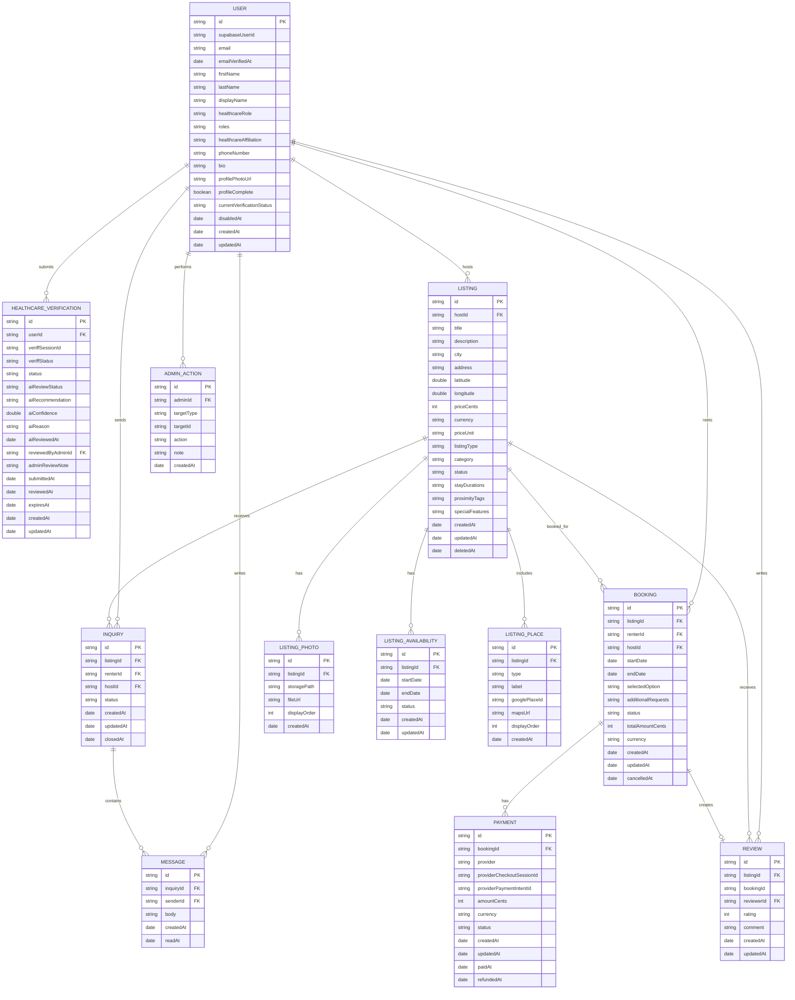

# MediCN ERD and Database Design
## Backend Week2

## Database Tech Stack

Database: PostgreSQL  
ORM: Prisma  
Backend: Node.js + NestJS  

## Proposed Table Summary

| Table | Purpose |
| --- | --- |
| `User` | Stores internal MediCN user profile data mapped to Supabase Auth. |
| `HealthcareVerification` | Stores Veriff status, AI recommendation, and admin review. |
| `Listing` | Stores the main housing listing record. |
| `ListingPhoto` | Stores photos attached to listings. |
| `ListingAvailability` | Stores host-defined available or blocked date windows. |
| `ListingPlace` | Stores nearby places and local recommendations. |
| `Inquiry` | Stores renter-to-host inquiry threads. |
| `Message` | Stores messages inside inquiry threads. |
| `Booking` | Stores request-to-book records. |
| `Payment` | Stores Stripe payment records. |
| `Review` | Stores listing reviews after completed bookings. |
| `AdminAction` | Stores audit logs for admin actions. |

## Table Details

### User

Stores internal user profile data. Supabase Auth handles signup, login, logout, password reset, email verification, and session creation.

| Field | Type | Constraints | Relationships / Notes |
| --- | --- | --- | --- |
| `id` | UUID/string | Primary key | Internal MediCN user ID. |
| `supabaseUserId` | string | Unique, required | Maps the internal user to Supabase Auth. |
| `email` | string | Unique, required | Synced from Supabase Auth. |
| `emailVerifiedAt` | timestamp | Nullable | Synced from Supabase Auth email confirmation status. `null` means the account exists but email-gated features should remain locked. |
| `firstName` | string | Optional | Synced from Supabase metadata or updated by user. |
| `lastName` | string | Optional | Synced from Supabase metadata or updated by user. |
| `displayName` | string | Optional | User-facing display name shown in profile surfaces. |
| `healthcareRole` | enum/string | Optional | Healthcare background selected during onboarding. Allowed values: `medical_student`, `nursing_student`, `nurse`, `resident_physician`, `physician`, `other`. |
| `roles` | enum array/string array | Required, default empty array | Allowed values: `renter`, `host`, `admin`. |
| `healthcareAffiliation` | string | Optional | MediCN-specific profile field. |
| `phoneNumber` | string | Optional | User contact/profile field. |
| `bio` | string | Optional | Public profile text. |
| `profilePhotoUrl` | string | Optional | Can be synced from Supabase metadata or uploaded later. |
| `profileComplete` | boolean | Default `false` | Used by onboarding flow. |
| `currentVerificationStatus` | enum/string | Default `not_started` | Cached latest status from `HealthcareVerification`. |
| `disabledAt` | timestamp | Nullable | Soft-disable support. |
| `createdAt` | timestamp | Required | Created timestamp. |
| `updatedAt` | timestamp | Required | Updated timestamp. |

Relationships:

| Relationship | Type |
| --- | --- |
| `User` -> `HealthcareVerification` | One-to-many |
| `User` -> `Listing` as host | One-to-many |
| `User` -> `Inquiry` as renter/host | One-to-many |
| `User` -> `Booking` as renter/host | One-to-many |
| `User` -> `Review` as reviewer | One-to-many |
| `User` -> `AdminAction` as admin | One-to-many |

Role rules:

| Rule | Reason |
| --- | --- |
| Signup metadata may assign `renter`, `host`, or both through `/auth/sync`. | Users may rent and host on the same platform. |
| Normal users cannot assign themselves `admin`. | Admin role must be protected by backend/admin operations. |
| `roles` should not contain duplicates. | Keeps authorization checks predictable. |
| `healthcareRole` is not an authorization role. | It describes the user's healthcare background, while `roles` controls renter/host/admin access. |
| Unconfirmed email accounts can exist. | Users may have an internal profile before email confirmation, but email-gated business actions should be blocked until `emailVerifiedAt` is set. |

### HealthcareVerification

Stores healthcare verification records, Veriff data, AI preliminary review, and admin final review.

| Field | Type | Constraints | Relationships / Notes |
| --- | --- | --- | --- |
| `id` | UUID/string | Primary key | Verification record ID. |
| `userId` | UUID/string | Required, foreign key | References `User.id`. |
| `veriffSessionId` | string | Optional, unique when present | External Veriff session ID. |
| `veriffStatus` | enum/string | Optional | Raw or mapped status from Veriff. |
| `status` | enum/string | Required | Final MediCN verification status. |
| `aiReviewStatus` | enum/string | Default `not_started` | AI process state. |
| `aiRecommendation` | enum/string | Optional | AI suggestion only. |
| `aiConfidence` | decimal/float | Optional | Suggested range `0.00` to `1.00`. |
| `aiReason` | text | Optional | Short explanation from AI. |
| `aiReviewedAt` | timestamp | Nullable | When AI review completed. |
| `reviewedByAdminId` | UUID/string | Nullable, foreign key | References `User.id` for admin reviewer. |
| `adminReviewNote` | text | Optional | Admin note for final decision. |
| `submittedAt` | timestamp | Nullable | When user submitted verification. |
| `reviewedAt` | timestamp | Nullable | When admin reviewed it. |
| `expiresAt` | timestamp | Nullable | Expiration date if applicable. |
| `createdAt` | timestamp | Required | Created timestamp. |
| `updatedAt` | timestamp | Required | Updated timestamp. |

Allowed `status` values:

| Value | Meaning |
| --- | --- |
| `not_started` | User has not started verification. |
| `pending` | Verification is waiting for review. |
| `approved` | Admin approved verification. |
| `rejected` | Admin rejected verification. |
| `expired` | Verification is no longer valid. |

Allowed `aiReviewStatus` values:

| Value | Meaning |
| --- | --- |
| `not_started` | AI review has not run. |
| `processing` | AI review is running. |
| `completed` | AI review completed. |
| `failed` | AI review failed. |

Allowed `aiRecommendation` values:

| Value | Meaning |
| --- | --- |
| `approve` | AI suggests approval. |
| `reject` | AI suggests rejection. |
| `needs_manual_review` | AI cannot confidently decide. |

Rules:

| Rule | Reason |
| --- | --- |
| AI review cannot change final `status` directly. | Admin must make the final decision. |
| `reviewedByAdminId` is required when status becomes `approved` or `rejected`. | Auditability. |
| `aiConfidence` should be between `0` and `1`. | Consistent scoring. |

### Listing

Stores the main housing listing record.

| Field | Type | Constraints | Relationships / Notes |
| --- | --- | --- | --- |
| `id` | UUID/string | Primary key | Listing ID. |
| `hostId` | UUID/string | Required, foreign key | References `User.id`; user must have `host` role. |
| `title` | string | Required | Listing title. |
| `description` | text | Required | Full listing description. |
| `city` | string | Required | Used for filtering/search. |
| `address` | string | Required or optional for MVP | Full address may be hidden from public response. |
| `latitude` | decimal/float | Optional | Used for map/search. |
| `longitude` | decimal/float | Optional | Used for map/search. |
| `priceCents` | integer | Required, `>= 0` | Store money as cents, not decimals. |
| `currency` | string | Required, default `USD` | Payment currency. |
| `priceUnit` | enum/string | Required | `day`, `night`, or `month`. |
| `listingType` | enum/string | Required | Example: `private_room`, `entire_home`, `shared_room`. |
| `category` | string | Optional | Search/filter category. |
| `status` | enum/string | Required | Listing moderation status. |
| `stayDurations` | enum array/string array | Optional | Example: `short_term`, `medium_term`, `long_term`. |
| `proximityTags` | enum array/string array | Optional | Example: `near_hospitals`, `public_transit`. |
| `specialFeatures` | enum array/string array | Optional | Example: `fully_furnished`, `pet_friendly`. |
| `createdAt` | timestamp | Required | Created timestamp. |
| `updatedAt` | timestamp | Required | Updated timestamp. |
| `deletedAt` | timestamp | Nullable | Soft delete/archive support. |

Allowed `status` values:

| Value | Meaning |
| --- | --- |
| `draft` | Host has not submitted listing yet. |
| `pending` | Waiting for admin approval. |
| `approved` | Publicly searchable. |
| `rejected` | Rejected by admin. |
| `hidden` | Hidden by moderation. |
| `archived` | Removed by host/admin. |

Relationships:

| Relationship | Type |
| --- | --- |
| `Listing` -> `User` host | Many-to-one |
| `Listing` -> `ListingPhoto` | One-to-many |
| `Listing` -> `ListingAvailability` | One-to-many |
| `Listing` -> `ListingPlace` | One-to-many |
| `Listing` -> `Inquiry` | One-to-many |
| `Listing` -> `Booking` | One-to-many |
| `Listing` -> `Review` | One-to-many |

### ListingPhoto

Stores photos connected to listings.

| Field | Type | Constraints | Relationships / Notes |
| --- | --- | --- | --- |
| `id` | UUID/string | Primary key | Photo ID. |
| `listingId` | UUID/string | Required, foreign key | References `Listing.id`. |
| `storagePath` | string | Required | Backend-generated Supabase path. |
| `fileUrl` | string | Required | Public or signed URL for display. |
| `displayOrder` | integer | Required, default `0` | Controls image ordering. |
| `createdAt` | timestamp | Required | Created timestamp. |

Constraints:

| Constraint | Purpose |
| --- | --- |
| Unique `listingId + displayOrder` | Prevent duplicate ordering within a listing. |
| `storagePath` generated by backend | Prevent arbitrary external uploads. |

### ListingAvailability

Stores host-defined available or blocked date windows.

| Field | Type | Constraints | Relationships / Notes |
| --- | --- | --- | --- |
| `id` | UUID/string | Primary key | Availability record ID. |
| `listingId` | UUID/string | Required, foreign key | References `Listing.id`. |
| `startDate` | date/timestamp | Required | Start of available or blocked window. |
| `endDate` | date/timestamp | Required | End of available or blocked window. |
| `status` | enum/string | Required | `available` or `blocked`. |
| `createdAt` | timestamp | Required | Created timestamp. |
| `updatedAt` | timestamp | Required | Updated timestamp. |

Constraints:

| Constraint | Purpose |
| --- | --- |
| `endDate > startDate` | Prevent invalid date windows. |
| Active bookings are not stored here as `booked`. | Booked dates come from `Booking`. |

### ListingPlace

Stores neighborhood perks and local recommendations shown on listing details.

| Field | Type | Constraints | Relationships / Notes |
| --- | --- | --- | --- |
| `id` | UUID/string | Primary key | Place record ID. |
| `listingId` | UUID/string | Required, foreign key | References `Listing.id`. |
| `type` | enum/string | Required | `neighborhood_perk` or `local_recommendation`. |
| `label` | string | Required | Display name. |
| `googlePlaceId` | string | Optional | Google Maps place identifier. |
| `mapsUrl` | string | Optional | Link to Google Maps result. |
| `displayOrder` | integer | Required, default `0` | Controls display ordering. |
| `createdAt` | timestamp | Required | Created timestamp. |

### Inquiry

Stores renter-to-host contact threads.

| Field | Type | Constraints | Relationships / Notes |
| --- | --- | --- | --- |
| `id` | UUID/string | Primary key | Inquiry thread ID. |
| `listingId` | UUID/string | Required, foreign key | References `Listing.id`. |
| `renterId` | UUID/string | Required, foreign key | References `User.id`; user should have `renter` role. |
| `hostId` | UUID/string | Required, foreign key | References `User.id`; copied from listing host. |
| `status` | enum/string | Required | `open`, `closed`, or `archived`. |
| `createdAt` | timestamp | Required | Created timestamp. |
| `updatedAt` | timestamp | Required | Updated timestamp. |
| `closedAt` | timestamp | Nullable | Set when inquiry is closed. |

Rules:

| Rule | Reason |
| --- | --- |
| `hostId` must match `Listing.hostId`. | Prevent messaging the wrong host. |
| If verification gating is enabled, renter must have approved verification. | Trust and safety. |

### Message

Stores messages inside inquiry threads.

| Field | Type | Constraints | Relationships / Notes |
| --- | --- | --- | --- |
| `id` | UUID/string | Primary key | Message ID. |
| `inquiryId` | UUID/string | Required, foreign key | References `Inquiry.id`. |
| `senderId` | UUID/string | Required, foreign key | References `User.id`. |
| `body` | text | Required | Message content. |
| `createdAt` | timestamp | Required | Created timestamp. |
| `readAt` | timestamp | Nullable | When message was read. |

Rules:

| Rule | Reason |
| --- | --- |
| `senderId` must be inquiry renter, listing host, or admin. | Access control. |
| Empty messages are not allowed. | Validation. |

### Booking

Stores request-to-book records.

| Field | Type | Constraints | Relationships / Notes |
| --- | --- | --- | --- |
| `id` | UUID/string | Primary key | Booking ID. |
| `listingId` | UUID/string | Required, foreign key | References `Listing.id`. |
| `renterId` | UUID/string | Required, foreign key | References `User.id`. |
| `hostId` | UUID/string | Required, foreign key | References `User.id`; copied from listing host. |
| `startDate` | date/timestamp | Required | Booking start. |
| `endDate` | date/timestamp | Required | Booking end. |
| `selectedOption` | string | Required | Example: `daily_short_term`. |
| `additionalRequests` | text | Optional | Renter notes. |
| `status` | enum/string | Required | Booking lifecycle status. |
| `totalAmountCents` | integer | Required, `>= 0` | Calculated by backend. |
| `currency` | string | Required, default `USD` | Payment currency. |
| `createdAt` | timestamp | Required | Created timestamp. |
| `updatedAt` | timestamp | Required | Updated timestamp. |
| `cancelledAt` | timestamp | Nullable | Set when cancelled. |

Allowed `status` values:

| Value | Meaning |
| --- | --- |
| `requested` | Renter requested booking. |
| `accepted` | Host accepted request. |
| `rejected` | Host rejected request. |
| `cancelled` | Booking cancelled. |
| `payment_pending` | Waiting for payment. |
| `paid` | Payment completed. |
| `completed` | Stay completed. |

Constraints:

| Constraint | Purpose |
| --- | --- |
| `endDate > startDate` | Prevent invalid booking dates. |
| `totalAmountCents` calculated by backend | Prevent payment tampering. |
| `hostId` must match `Listing.hostId` | Prevent invalid host relation. |

### Payment

Stores Stripe payment records.

| Field | Type | Constraints | Relationships / Notes |
| --- | --- | --- | --- |
| `id` | UUID/string | Primary key | Payment ID. |
| `bookingId` | UUID/string | Required, foreign key | References `Booking.id`. |
| `provider` | string | Required, default `stripe` | Payment provider. |
| `providerCheckoutSessionId` | string | Unique, optional | Stripe Checkout Session ID. |
| `providerPaymentIntentId` | string | Unique, optional | Stripe PaymentIntent ID. |
| `amountCents` | integer | Required, `>= 0` | Amount charged. |
| `currency` | string | Required, default `USD` | Payment currency. |
| `status` | enum/string | Required | Payment lifecycle status. |
| `createdAt` | timestamp | Required | Created timestamp. |
| `updatedAt` | timestamp | Required | Updated timestamp. |
| `paidAt` | timestamp | Nullable | Set after payment succeeds. |
| `refundedAt` | timestamp | Nullable | Set after refund. |

Allowed `status` values:

| Value | Meaning |
| --- | --- |
| `pending` | Payment started but not completed. |
| `paid` | Payment succeeded. |
| `failed` | Payment failed. |
| `refunded` | Payment refunded. |
| `disputed` | Payment disputed. |

### Review

Stores listing reviews after completed bookings.

| Field | Type | Constraints | Relationships / Notes |
| --- | --- | --- | --- |
| `id` | UUID/string | Primary key | Review ID. |
| `listingId` | UUID/string | Required, foreign key | References `Listing.id`. |
| `bookingId` | UUID/string | Required, unique, foreign key | References `Booking.id`; one review per booking. |
| `reviewerId` | UUID/string | Required, foreign key | References `User.id`; must be booking renter. |
| `rating` | integer | Required, `1` to `5` | Star rating. |
| `comment` | text | Optional | Review text. |
| `createdAt` | timestamp | Required | Created timestamp. |
| `updatedAt` | timestamp | Required | Updated timestamp. |

Rules:

| Rule | Reason |
| --- | --- |
| Booking must be `completed`. | Prevent reviews before stay completion. |
| `reviewerId` must match booking renter. | Prevent unrelated reviews. |
| `bookingId` unique | Prevent duplicate reviews. |

### AdminAction

Stores audit logs for admin actions.

| Field | Type | Constraints | Relationships / Notes |
| --- | --- | --- | --- |
| `id` | UUID/string | Primary key | Admin action ID. |
| `adminId` | UUID/string | Required, foreign key | References `User.id`; user must have `admin` role. |
| `targetType` | enum/string | Required | Example: `listing`, `verification`, `user`. |
| `targetId` | UUID/string | Required | ID of the affected record. |
| `action` | enum/string | Required | Example: `approve`, `reject`, `hide`, `disable_user`. |
| `note` | text | Optional | Admin note. |
| `createdAt` | timestamp | Required | Created timestamp. |

## Relationship Summary

| Relationship | Cardinality | Implementation |
| --- | --- | --- |
| `User` to `HealthcareVerification` | One-to-many | `HealthcareVerification.userId -> User.id` |
| `User` to `Listing` | One-to-many | `Listing.hostId -> User.id` |
| `Listing` to `ListingPhoto` | One-to-many | `ListingPhoto.listingId -> Listing.id` |
| `Listing` to `ListingAvailability` | One-to-many | `ListingAvailability.listingId -> Listing.id` |
| `Listing` to `ListingPlace` | One-to-many | `ListingPlace.listingId -> Listing.id` |
| `Listing` to `Inquiry` | One-to-many | `Inquiry.listingId -> Listing.id` |
| `Inquiry` to `Message` | One-to-many | `Message.inquiryId -> Inquiry.id` |
| `Listing` to `Booking` | One-to-many | `Booking.listingId -> Listing.id` |
| `Booking` to `Payment` | One-to-many | `Payment.bookingId -> Booking.id` |
| `Booking` to `Review` | One-to-zero-or-one | `Review.bookingId -> Booking.id`, unique |
| `Listing` to `Review` | One-to-many | `Review.listingId -> Listing.id` |
| `User` to `AdminAction` | One-to-many | `AdminAction.adminId -> User.id` |

## Constraints

| Constraint | Applies To | Reason |
| --- | --- | --- |
| `supabaseUserId` must be unique | `User` | One internal user per Supabase Auth account. |
| `email` must be unique | `User` | Prevent duplicate accounts. |
| `emailVerifiedAt` is synced from Supabase Auth | `User` | Backend can enforce email confirmation for protected business actions. |
| `roles` cannot include duplicate values | `User` | Prevent duplicate roles. |
| `admin` role cannot be self-assigned | `User` | Protect admin access. |
| `priceCents >= 0` | `Listing` | Prevent invalid prices. |
| `endDate > startDate` | `ListingAvailability`, `Booking` | Prevent invalid date ranges. |
| `amountCents >= 0` | `Payment` | Prevent invalid payment amounts. |
| `rating BETWEEN 1 AND 5` | `Review` | Valid review rating. |
| `bookingId` unique | `Review` | One review per booking. |
| Admin final decision required | `HealthcareVerification` | AI only provides recommendation. |
| Backend calculates payment amount | `Booking`, `Payment` | Prevent frontend tampering. |

## ERD

